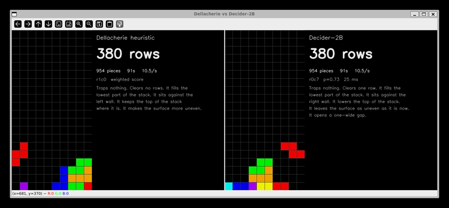

# decider-tetris

**A 2B decision model plays Tetris by reading sentences. This is the log of what it took to get it
from 41 rows to 14,338 — and what each step says about tuning a local system-one model.**



`race.py`: the published heuristic on the left, the model on the right, one piece sequence between
them. Under each board is what that player acted on — the heuristic's weighted score, and for the
model the option text it picked and the probability it gave it.

## A model playing a game is not the point

The point is that every step of the tuning is attributable. The baseline is a published
controller with a number attached, the model's picks are recorded next to what the baseline would
have picked, and the game either keeps going or it does not. So a change can be judged two ways:
on a single decision, and on whether the run survives.

Every rule below came out of the same loop. Replay the disagreements, find what the costly ones
share, change one thing, measure. Nothing here is a reworded prompt.

And the loop is short. Tens of thousands of decisions take five to seven minutes on one
consumer card, which is what makes this method possible at all: the same sweep against a hosted
frontier model is hours and a bill.

## What it runs on

Python enumerates every landing the piece can reach and states what each one does to the stack.
The model only picks one. It never sees the board, counts a cell or compares a number.

The model is any endpoint that answers the TypeSafe Jev wire format (`POST /v1/systemone`, a
`choice` question with up to 255 described options). The runs here used the open
[Decider-2B](https://huggingface.co/Mapika/decider-2b) v8 checkpoint on one RTX 3070 Ti, about
43 ms per question and 60 ms per piece end to end.

One option, as the model reads it:

```
Traps nothing. Clears one row. It fills the lowest part of the stack. It sits against the right
wall. It lowers the top of the stack. It leaves the surface as uneven as it is now. It opens a
one-wide gap.
```

The [Dellacherie evaluation](https://hal.science/hal-00926213/document) scores the same landings on
every piece, so every run carries its own baseline.

## Where it stands

| | pieces | rows |
|---|---|---|
| Decider-2B, every rule below | 35,874 | 14,338 |
| Dellacherie heuristic, same seed, stopped at the row cap | 75,004 | 30,000 |
| Dellacherie heuristic, as published | — | about 600,000 a game |

The heuristic is not beaten in that table; it is interrupted. Six hundred thousand rows is the
distance still to go, and it is the honest frame for everything below.

**Rows are a saturated measure here.** Over the 14,338-row game the stack averaged 4.7 rows high
with 0.6 buried cells, and every 2,500 pieces cleared exactly 1,000 rows: 2,500 pieces are 10,000
cells and 1,000 rows are 10,000 cells, so no cell is wasted. Rows are pieces times 0.4, and the
only thing that varies is when the run dies. The ruler used here is the climb — every time the
stack passes twelve rows is one sample, and the game ends when one climb does not come back down.
The 14,338-row game survived 63 climbs; the 5,893-row game survived 19. Sixty samples a game beats
one.

## How it got there

| change | rows |
|---|---|
| one sentence of facts per landing | 41 |
| name the one-wide gap in the instructions, since the options already report it | 57 |
| never offer a landing that traps a cell while a clean landing exists | 139 |
| state the height as a change from the current stack, not as a fixed band | 243 |
| *(the four rows above ran to a 150-piece cap; the next three to 500 pieces)* | |
| put every landing in one question instead of a tournament of tens | 898 |
| read the list backwards and add the probabilities when the top two are within 0.15 | 974 |
| say in the instructions that a landing against a wall beats one in the middle | 987 |
| *(a tie in `settle` was broken by set iteration order, which Python randomises per process, so one seed gave 3894, 1863 and 322 rows under the same flags. Every number above predates the fix. Every number below is one uncapped game on seed 6.)* | |
| when the red line has to bury, offer only the landings that bury fewest | 3,396 |
| hide the landings that leave a gap three or more rows deep, while a shallower one exists | 5,893 |
| above fifteen rows, let a burying landing through when fewer than three clean ones remain | 9,981 |
| drop the landings that leave the next piece no landing of its own that buries nothing | **14,338** |

## What the model turned out to be like

Three properties of this checkpoint, each measured rather than assumed, each worth carrying to any
other local system-one model.

**Instructions have to be concrete and short.** The same four goals written as an ordered list
("First… Second… Third…") scored 0 rows in five games against 41 for one short sentence. Over the
whole log, adding a sentence to an option or to the instructions lost rows six times out of six.
Only rewriting a sentence already there ever gained any.

**Position pulls the score.** Asking one position twelve times under twelve option orders:

| | decisions | mean gap between the top two probabilities |
|---|---|---|
| same pick every time | 3 | 0.34 |
| pick changed with the order | 11 | 0.12 |

The model separates similar landings by less than the pull of the leading position. Reading the
list once forwards and, only when the top two are within 0.15, once backwards costs about 1.3
questions per piece and removes it. No random draw is involved, so one board always produces one
decision.

**Code should delete, not persuade.** A landing that buries a cell while a clean landing is on
offer is never right, so the code removes it before the model sees it. On the boards recorded
before each death the red lines take 22.8 reachable landings down to 3.3, the one-piece lookahead
to 3.0, and identical wording merges those into 2.8 sentences. The split is deliberate: arithmetic
that can prove a landing wrong belongs in code, and ranking what survives belongs to the model.

## What did not work

Each line is a measurement, and each one cost a few hundred games.

| attempt | result |
|---|---|
| the same four goals as an ordered list ("First… Second… Third…") | 0 rows in five games, against 41 for one short sentence |
| the board itself in the state, as 20 rows of text | 41 pieces against 86; the model's own card reports the same weakness on positional lookups |
| the same board as TOON instead of JSON | 60 pieces against 41: the per-element `_index` markers hurt, but a grid still hurts more than no grid |
| rating each landing alone with a yes/no question | 11 rows against 18, and four times slower: a landing rated alone has nothing to be better than |
| a next-piece fact ("the next piece can clear a row here") | worse on three of four seeds |
| dropping landings that another landing beats on every fact at once | leaves a median of one option, so the code is playing, not the model |
| sorting the options best-first | 844 rows against 822 for the enumeration order |
| relaxing the buried-cell red line at any height | 288 rows against 5,893. The same relaxation above fifteen rows reaches 9,981, so the height gate carries the whole effect |
| letting a burying landing through when it clears two rows | 2,803 against 5,893 |
| rewording which part of the stack the landing sits on | 3,882 against 5,893 |
| raising the second-reading threshold from 0.15 to 0.3 | 2,462 against 5,893 |
| predicting a climb from the board | four measures tried at the moment the stack first passes eight rows — buried cells, unevenness, surviving landings, and how many of the seven pieces the stack can take without growing taller. None separates the 36 excursions that ran away from the 375 that did not |

### Decider-2B v10 against v8

v10 continues v8 with calibration-aware reinforcement learning on browser click tasks and on games
with an exact probability law. Its card reports the browser gain in sampled play, not in the argmax.
Here, same flags and same seed, one game each:

| | v8 | v10 |
|---|---|---|
| mean confidence | 0.578 | 0.649 |
| second readings per piece | 0.211 | 0.094 |
| mean buried cells | 0.615 | 0.620 |
| climbs survived | 63 | 31 |
| rows | 14,338 | 7,731 |

v10 is the more decisive model and it asks for the second reading half as often, which makes it
about ten per cent cheaper per piece. It did not keep a cleaner board and it did not last longer.
One game each is two samples of a heavy-tailed variable, and two such samples differ by two times a
third of the time, so this says v10 is not better at this task — not that it is worse.

## Running it

```bash
uv sync
uv run python -m decider_tetris.play --decider http://127.0.0.1:8000 \
    --wording walls --group 20 --order enum --settle 0.15 \
    --clean --grade --fills --least --gap any --relax 3 --high 15 --foresee 10 \
    --seed 6 --max-pieces 200000 --postmortem death.json
uv run python -m decider_tetris.play --games 5          # the heuristic alone, no model needed
uv run python -m decider_tetris.race --decider http://127.0.0.1:8000    # both, side by side
```

That first line is the 14,338-row run. Every switch on it is one row of the table above, and the
result line repeats all of them, so a number always says which flags produced it. `--seed` must be
1 or more: the environment reads `if seed and seed > 0`, so seed 0 is taken as no seed and the
pieces come from the operating system, which makes a run look reproducible when it is not.

`--decider` is the base URL of anything that answers `POST /v1/systemone`. For the open checkpoint,
its own `decider.serve` works, though it captures a CUDA graph for 78 shapes before answering the
first request; a server that builds graphs on demand starts in about a minute on an 8 GB card.

`race` puts both players in one window on the same piece sequence. `--free` lets each side run at
its own speed instead of one piece each in turn.

`web.py` plays the published [react-tetris](https://chvin.github.io/react-tetris/) page instead of
the local board: it reads the page's own Redux state out of `localStorage`, sends key events over
CDP, and changes nothing on the page. Its rules mirror that page's source, so a landing is only
offered if the page would accept it; over twelve pieces its predicted board matched the page's
board exactly every time.

## Layout

```
src/decider_tetris/
  placements.py        every landing the piece can reach, its facts in words, the baseline score
  play.py              one game, and the flags every measurement above was made with
  race.py              both players in one window, in step or at their own speed
  regret.py            replays each disagreement with the heuristic and says what it cost
  view.py              the board drawn with the decision beside it
  web.py               the same player driving the published react-tetris page
  tournament_probe.py  asks one decision two ways to measure what grouping costs
tests/                 27 tests, including one per red line and one for the tie-break
```

## Credits

The board is [Tetris Gymnasium](https://github.com/Max-We/Tetris-Gymnasium). The split between
arithmetic in code and judgement in a fast model follows
[jev-game-tools](https://github.com/Eniip/jev-game-tools), which plays Brotato the same way.
